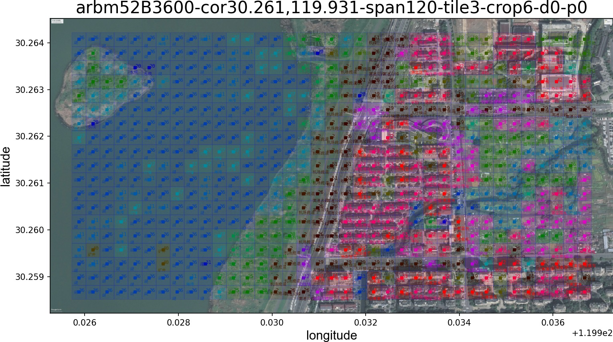

My first open-source software: Caption Scape, a visualization tool showcasing the classification effects of SkyScript on remote sensing maps.

# 1 Introduction

## 1 Introduction of SkyScript

The work on this project originated from a paper <SkyScript: A Large and Semantically Diverse Vision-Language Dataset for Remote Sensing> (Wang et al. AAAI2014).

- The paper introduces SkyScript, a large-scale and semantically diverse remote sensing image-text dataset designed to advance the development of vision-language models (VLMs) in the field of remote sensing.

- By automatically connecting unlabelled remote sensing images with the rich semantic information from OpenStreetMap (OSM) using geographic coordinates, a dataset containing 2.6 million image-text pairs was constructed, covering 29,000 different semantic labels.

- **Through continuous pre-training on this dataset, a VLM was obtained** that achieved an average accuracy increase of 6.2% over the baseline model across seven benchmark datasets, and demonstrated **zero-shot transfer capabilities** in fine-grained object attribute classification and cross-modal retrieval.

For detailed content, please refer to the paper https://arxiv.org/abs/2312.12856. The related code can be found at https://github.com/wangzhecheng/SkyScript.

## 2 Introduction of CaptionScape
- Motivation：
The project "SkyScript" only provides a program for calculating accuracy of classification or fine-grained classification, but does not offer visualization examples, making it difficult to intuitively see the application effects of the algorithm on remote sensing maps. To address this, an additional program has been developed to allow users to quickly visualize the effects of the algorithm.

- Program development approach:
Crop remote sensing image into tiles, then predict caption of each tile and plot all the captions on the remote sensing image, call it caption scape.
In caption scape image, the captions will overlapping on the image in form of semitransparent rectangle, so that we can see the predicted caption of the tile and it's corresponding ixels at the same time. 
In this way, the effect of the SkyScript algorithm can be verified directly.
Related work is encapsulated into class CapMap.

# 2 Specification before running caption_scape.py

## 1 How to running this program:
    # Before running this program, you have to 
    Fork or download this project to local PC and setup environment.

    Open CaptionScape in vscode, and open caption_scape.py:
    
    # Step1. Specify YOUR root direction parameter '--rootpath='.
    # The inputs and outputs can save to this direction.
    YOUR_ROOT_DIR = '/.../.../...'
    
    # Step2. Build a new document "rsimage" under your root dir
    # and copy a remote sensing image in it. The image should be
    # "*.jpg" or "*.png" or "*.bmp".
    
    # Step3. Specify YOUR direction of pretrained model. 
    # PRETRAINED_VIT_MODEL = '/.../.../*.pt'

    # The other paragrames canbe defaulted in the first running.
    # You can adjust them according to your own needs.
    
    # If you want to display chinese label characters, please 
    # download and copy "simsun.ttc" file to document "rsimage".
    # and the parameter '--label-language=' shouild be 'chinese'.

## 2 About the input remote sensing image.
The remote sensing map can be a general map, and the image name can be a common word or in the format of "latitude,longitude.jpg". If it is the latter, the user can modify the length values in meters corresponding to the RSI_WIDTH_METER and RSI_HEIGHT_METER parameters in the initialization program of the CapMap class. Consequently, the final output caption scape image will be drawn according to the latitude and longitude proportionality.
The algorithm's effect is shown in the figure below.

# 3 Detailed instructions for modifying the original program “SkyScript”.

## 1🌱add caption_scape.py
    Define class and Provide a runing demo.

## 2🌱add classnames.py
    Including the list of class names in different language.

## 3🌟Modify params.py 
    📘parse_args()
        📌add content:
        "
        parser.add_argument(
            "--pred-csv-path",
            type=str,
            default=None,
            help="The saving path of csv file, to save predictions of tiles.",
        )   
        parser.add_argument(
            "--pretrained-model",
            type=str,
            default=None,
            help="The path of download pretrained model.",
        )
        " 
        at the end of function "parse_args(args)".

    🌱add function:
        def parse_args_cap(args):
            """
            Parse parameters for caption scape class.
            """ 
            ......

## 4🌟Modify test_zero_shot_classification.py
    📘test()  
        📌add content: 
            "predcsv = args.pred_csv_path" below "args = parse_args(args)".
            and add parameter 
            "predcsv=predcsv, " into the brackets of
            results = test_zero_shot_classification(..., predcsv=predcsv, ...)

    📘test_zero_shot_classification() 
        📌add Function form parameter: "predcsv='pred.csv'" in function brackets like:
            test_zero_shot_classification(..., predcsv='pred.csv',...)
            and add "predcsv=predcsv," in the 7th line as below: 
            results = run(..., predcsv=predcsv, ...)

    📘run()
        📌add Function form parameter: "predcsv='pred.csv'"

        
        📌add content:
            "list_pred = []" 
            at the begining of section "with torch.no_grad():", 

        📌modified 
            "acc1, acc5 = accuracy(logits, target, topk=(1, 5))"
            to :
            "
            lst_topk_result, pred_ = accuracy(logits, target, topk=(1, 5))  
            list_pred.append(pred_)
            acc1, acc5 = lst_topk_result
            "

        📌add content:
            "
            if len(list_pred) == 1:  # n_tile < batchsize
                tensor_pred = list_pred[0]
            else:
                # Combined by columns:e.g. 5*128，concat to 5*256， so dim=1
                tensor_pred = torch.cat(list_pred, dim=1)
            # Save prediction to csv file.
            tensor_np = tensor_pred.cpu().numpy().T
            # NumPy to Pandas DataFrame
            df = pd.DataFrame(tensor_np)
            df.to_csv(predcsv, index=False)       
            " 
            at the end of section "with torch.no_grad():", 

    📘accuracy() /
        📌modified 
            "
            def accuracy(output, target, topk=(1,)):
                pred = output.topk(max(topk), 1, True, True)[1].t()
                correct = pred.eq(target.view(1, -1).expand_as(pred))
                return [float(correct[:k].reshape(-1).float().sum(0, keepdim=True).cpu().numpy()) for k in topk]
            "
            to:
            "
            def accuracy(output, target, topk=(1,)):
                pred = output.topk(max(topk), 1, True, True)[1].t()
                pred_top1 = output.topk(1, 1, True, True)[1].t()
                correct = pred.eq(target.view(1, -1).expand_as(pred))
                lst_topk_result = [float(correct[:k].reshape(-1).float().sum(0, keepdim=True).cpu().numpy()) for k in topk]
                return lst_topk_result, pred_top1
            "
## 5
Considering the extensive modifications required in Module "test_zero_shot_classification.py", 
we can create a new file "test_zero_shot_classification_for_cap.py" specifically for the implementation of this task. We only need to modify an import sentence in "caption_scape.py". 

